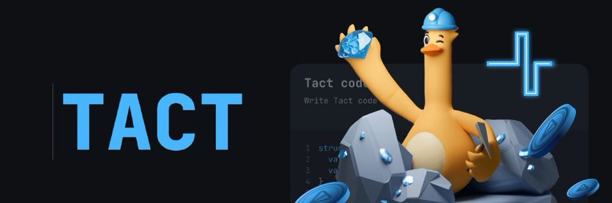

# Welcome to ⚡ Tact Documentation

[](https://starlight.astro.build)

Hello there! This is the source for the Tact language documentation.

Latest docs are always available at: [docs.tact-lang.org](https://docs.tact-lang.org).

Our goal here is to create a welcoming and rich resource that benefits all Tact developers, from beginners to experts.

## 🌟 Join the Tact community

Tact is not just a technology; it's a growing community of developers like you! Whether you are just starting out or have tons of experience, your contributions are valuable.

Here's how you can contribute:

- Organize or clarify information 📝
- Make Pull Requests to improve the code or docs 🚀
- Share tutorials, guides, and articles 📚

Join our community chat to stay updated and collaborate: [Tact Telegram community](https://t.me/tactlang)

## 🤔 How can you contribute?

Contributing is not just encouraged, it's easy!

If you've solved a challenging problem or found a better way to explain a complex topic, share it:

— Got an idea? [Open an issue](https://github.com/tact-lang/tact/issues/new).
— Ready to contribute? [Setup the dev environment](#setup-your-development-environment).

### ⚙️ Setup your development environment

Before you submit your amazing contributions, ensure they work seamlessly.

#### 🌩️ Quick cloud setup

Use Gitpod for a hassle-free cloud-based IDE experience:

[](https://gitpod.io/#https://github.com/tact-lang/tact-docs)

#### 🏠 Local setup

1. Clone this GitHub repository.
2. Make sure to have the latest version of [Node.js LTS](https://nodejs.org/en/download/) installed.
3. Open your terminal in the project directory.
4. Install dependencies without modifying the `yarn.lock`:

   ```
   yarn deps
   ```

5. Start your local development server:

   ```
   yarn dev
   ```

This will open a new browser window displaying your local version of the documentation. Most updates are automatically reflected.

### 🚀 Project Structure

Inside of this Astro + Starlight project, you'll see the following folders and files (besides others):

```
.
├── public/
├── src/
│   ├── assets/
│   ├── content/
│   │   ├── docs/     ← HERE ARE ALL THE TACT DOCUMENTATION PAGES
│   │   └── config.ts
│   └── env.d.ts
├── astro.config.mjs
├── package.json
└── tsconfig.json
└── cspell.json
```

Starlight looks for `.md` or `.mdx` files in the `src/content/docs/` directory. Each file is exposed as a route based on its file name. The Tact docs use `.mdx` files only.

Images can be added to `src/assets/` and embedded in MDX files with a relative link. Static assets, like favicons, can be placed in the `public/` directory.

It's recommended that local images are kept in `src/` whenever possible, so that Astro can transform, optimize and bundle them. Files in the `public/` directory are always served or copied into the build folder as-is, with no processing, and are publicly available by a direct link.

The local images stored in `src/` can be used by all files in the project: `.astro`, `.md`, `.mdx`, `.mdoc`, and other UI frameworks (if any). Images can be stored in any folder, including alongside your content.

### 🧞 Commands

All commands are run from the root of the project, from a terminal:

| Command                   | Action
| :------------------------ | :-----
| `yarn deps`               | Installs dependencies.
| `yarn dev`                | Starts local dev server at `localhost:4321`.
| `yarn build`              | Build your production site to `./dist/`. Runs CSpell and also validates all the internal links.
| `yarn preview`            | Preview your build locally, before deploying.
| `yarn astro ...`          | Run CLI commands like `astro add`, `astro check`, etc.
| `yarn astro -- --help`    | Get help using the Astro CLI.

### 👀 Want to learn more about the framework behind Tact docs?

Check out [Starlight’s docs](https://starlight.astro.build/), read [the Astro documentation](https://docs.astro.build), or jump into the [Astro Discord server](https://astro.build/chat).

## License 📄

[CC BY 4.0](https://creativecommons.org/licenses/by/4.0/)
