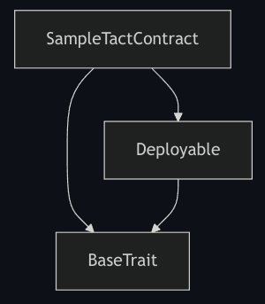
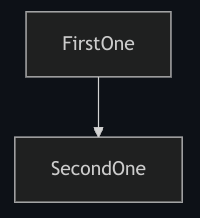
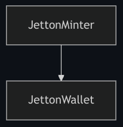

import { Badge, Tabs, TabItem } from '@astrojs/starlight/components';

The Tact compiler can produce various outputs, ranging from the [BoC][boc] of the [compiled contract](#boc) to various supplementary files, such as the [compilation report](#report) or the [contract package](#pkg).

With the proper [configuration settings](/book/config), you can customize the behavior of the compiler to skip the generation of some or all the [build artifacts](#artifacts), and even control the addition or exclusion of [getters for supported interfaces](/book/contracts#interfaces).

Since the Tact compiler is a command-line program, some of the configuration settings can be set directly. When inside a folder with a Tact-based project, such as one created using the [Blueprint][bp] or from the [tact-template](https://github.com/tact-lang/tact-template), refer to the `npx tact --help{:shell}` command for further instructions.

## Single Contract Compilation

When compiling a single contract file directly, you can use command line flags to control the compilation process. For example:

```shell
tact contract.tact --check     # Only perform syntax and type checking
tact contract.tact --func      # Output intermediate FunC code
```

You can also specify a custom output directory using the `-o` or `--output` flag:

```shell
tact contract.tact --output ./custom-output
```

This will place all generated files in the specified directory. If not specified, the files will be generated in the same directory as the input file.

## Compiler upgrades {#upgrades}

Work on the compiler is active and extensive, so be sure to check out [NPM](https://www.npmjs.com/package/@tact-lang/compiler) whenever we push new releases. To follow updates, see the [Tact Kitchen in Telegram](https://t.me/tact_kitchen) for the short scoop, or our [GitHub organization](https://github.com/tact-lang) for the whole picture in all its details.

To upgrade the Tact compiler to its latest version in a [Blueprint][bp]-based project or a project created from the [tact-template](https://github.com/tact-lang/tact-template), run:

<Tabs>
 <TabItem label="yarn" icon="seti:yarn">
   ```shell
   # recommended
   yarn upgrade @tact-lang/compiler
   ```
 </TabItem>
 <TabItem label="npm" icon="seti:npm">
   ```shell
   npm i @tact-lang/compiler@latest
   ```
 </TabItem>
 <TabItem label="pnpm" icon="pnpm">
   ```shell
   pnpm upgrade @tact-lang/compiler
   ```
 </TabItem>
 <TabItem label="bun" icon="bun">
   ```shell
   bun update --latest @tact-lang/compiler
   ```
 </TabItem>
</Tabs>

Sometimes, bug fixes require us to change the existing behavior, introducing small breaking changes. To be prepared for these, make sure to read the [CHANGELOG.md](https://github.com/tact-lang/tact/blob/main/dev-docs/CHANGELOG.md) and act accordingly. Except for bug fixes, Tact tries its best not to introduce breaking changes in minor or patch versions according to [semantic versioning](https://semver.org/#summary).

If you want to pin down a specific version of the compiler, run the following command. There, `X.Y.Z` is the target version you want to install:

<Tabs>
 <TabItem label="yarn" icon="seti:yarn">
   ```shell
   # X.Y.Z must be replaced by the actual version number
   yarn add --exact @tact-lang/compiler@X.Y.Z
   ```
 </TabItem>
 <TabItem label="npm" icon="seti:npm">
   ```shell
   # X.Y.Z must be replaced by the actual version number
   npm i --save-exact @tact-lang/compiler@X.Y.Z
   ```
 </TabItem>
 <TabItem label="pnpm" icon="pnpm">
   ```shell
   # X.Y.Z must be replaced by the actual version number
   pnpm add --save-exact @tact-lang/compiler@X.Y.Z
   ```
 </TabItem>
 <TabItem label="bun" icon="bun">
   ```shell
   # X.Y.Z must be replaced by the actual version number
   bun add --exact @tact-lang/compiler@X.Y.Z
   ```
 </TabItem>
</Tabs>

:::caution

  Do not mix different Node.js package managers in your projects. If you created the [Blueprint][bp] project with `npm`, stick to using `npm` for the rest of the commands — this will ensure that you don't get "File not found" errors or lock-file conflicts between different package managers.

  For example, using the `npm` package manager to install dependencies and then switching to `yarn` to build the contracts can lead to the following error message:

  ```shell
  File not found: tact_Task1.headers.fc
    #include "tact_Task1.headers.fc";
  💥 Compilation failed. Skipping packaging
  Error: Could not compile tact
  error Command failed with exit code 1.
  ```

:::

## Build artifacts {#artifacts}

A number of build artifacts can be produced per compilation of each contract. Some of the artifacts can be omitted using [configuration settings](/book/config).

The location of the artifacts depends on the compilation method:
- For projects using `tact.config.json`, use the [`output`](/book/config#projects-output) field in the config file
- For single contract compilation, you can specify the output directory using the `-o` or `--output` flag:
  ```shell
  tact contract.tact --output ./custom-output
  ```
  If not specified, the files will be generated in the same directory as the input file.

In [Blueprint][bp]-based projects, `output` is not used and all generated files are always placed in `build/ProjectName/`.

### Compilation report, `.md` {#report}

Every markdown compilation report first features the name of the contract that it was prepared for and then the byte size of the contract compiled to [BoC](/book/cells#cells-boc).

The following sub-headings describe the respective sections of the `.md` report.

#### Structures {#structures}

<Badge text="Written as '# Types' prior to Tact 1.6" variant="tip" size="medium"/><p/>

The first section introduces the present structures, i.e. some of the [composite types](/book/types#composite-types), [Structs and Messages](/book/structs-and-messages) that are declared or imported directly in the contract code, as well as those exposed from the Core standard library.

Along with the number of structures present, each of the [Structs][struct] and [Messages][message] are described with their respective signatures and [TL-B schemas][tlb], which include the [message opcodes](/book/structs-and-messages#message-opcodes).

For example:

```md
Total structures: 10

### StateInit
TL-B: `_ code:^cell data:^cell = StateInit`
Signature: `StateInit{code:^cell,data:^cell}`

### Deploy
TL-B: `deploy#946a98b6 queryId:uint64 = Deploy`
Signature: `Deploy{queryId:uint64}`

...etc.
```

[TL-B schema][tlb] of each [Message][message] contains its opcode, which is handy for looking up the auto-generated opcodes as well as confirming the [manually provided ones](/book/structs-and-messages#message-opcodes). For example, the following [Message][message] declarations:

```tact
message GeneratedOpcode { }
message(0x12345678) ManuallySpecifiedOpcode { }
```

translate to their respective [TL-B schemas][tlb]:

```md
### GeneratedOpcode
TL-B: `generated_opcode#6dfea180  = GeneratedOpcode`
Signature: `GeneratedOpcode{}`

### ManuallySpecifiedOpcode
TL-B: `manually_specified_opcode#12345678  = ManuallySpecifiedOpcode`
Signature: `ManuallySpecifiedOpcode{}`
```

where `6dfea180` and `12345678` specified after the `#` in the [constructor definitions](https://docs.ton.org/v3/documentation/data-formats/tlb/tl-b-language#constructors) are opcodes written in hexadecimal notation, representing $32$-bit unsigned integers. Thus, the automatically generated `6dfea180` opcode of the `GeneratedOpcode{:tact}` [Message][message] represents the decimal value of $1845404032$, and the manually provided `12345678` opcode of the `ManuallySpecifiedOpcode{:tact}` [Message][message] represents the decimal value of $305419896$, and **not** $12345678$ as it might appear.

#### Get methods {#getters}

This section specifies the number of available get methods or [getter functions](/book/functions#getter-functions) and outlines them with their argument names, if any.

For example:

```md
Total get methods: 2

## lshift
Argument: x

## gas
```

There, the `lshift(){:tact}` getter has a single argument `x`, whereas the `gas(){:tact}` getter has no arguments.

#### Exit codes {#exit-codes}

This section lists all default [exit codes](/book/exit-codes), as well as those generated from the error messages of the [`require(){:tact}`](/ref/core-debug#require), along with those messages for your convenience.

For example:

```md
* 2: Stack underflow
* 3: Stack overflow
...etc.
* 135: Code of a contract was not found
* 42933: Hey, I'm the error message of require()
```

There, the [exit codes](/book/exit-codes) in the range from $0$ to $255$ are those reserved by TON Blockchain or Tact compiler, while the exit code of $42933$ is produced by the respective call to the [`require(){:tact}`](/ref/core-debug#require) function.

#### Trait inheritance diagram {#trait-diagram}

This section shows a [Mermaid][mm] diagram of [inherited traits](/book/contracts#traits), including the [`BaseTrait{:tact}`](/ref/core-base).

For example:



There, [`JettonWallet`][code-jetton-wallet] inherits the `WalletExitcodes` and `GasConstant` traits, and all inherit the [`BaseTrait{:tact}`](/ref/core-base).

#### Contract dependency diagram {#contract-diagram}

This section shows a [Mermaid][mm] diagram of [contract](/book/contracts) dependencies, i.e. any calls to [`initOf{:tact}`](/book/expressions#initof) in order to compute the initial state of other contracts.

If the contract has no dependencies, only its name is displayed:


However, if the contract, say `FirstOne`, somewhere in its code computes the [initial state](/book/expressions#initof) of another contract, say `SecondOne`, such a relationship is shown in the diagram:



A real-world example of this would be the [`JettonMinter`][code-jetton-minter] contract, commonly referred to as the [Jetton Master](/cookbook/jettons#jetton-master-contract). Often, `JettonMinter` needs the [initial state](/book/expressions#initof) of the [`JettonWallet`][code-jetton-wallet], which is why `JettonMinter` defines the following [internal function](/book/contracts#internal-functions):

```tact
inline fun getJettonWalletInit(address: Address): StateInit {
    return initOf JettonWallet(address, myAddress());
}
```

Thus, the following dependency diagram is produced:



### Compiled contract, `.boc` {#boc}

The end result of compiling each contract is to get its code in the [BoC][boc] format, which is placed in a binary file with the `.boc` extension.

By combining the initial code with the initial data for the contract, you can locally and deterministically obtain the blockchain [`Address{:tact}`](/book/types#primitive-types) for the given contract.

From there, you'd only need to send the message containing the initial code and data, usually referred to as initial state or [`StateInit{:tact}`](/book/expressions#initof), to the computed address and provide enough Toncoin for the deployment.

But instead of doing this manually, prefer using the provided [TypeScript wrappers](#wrap-ts) and other [deployment facilities](/book/deploy).

:::note

  When compiling with the [`fullWithDecompilation`](/book/config#projects-mode) mode set in the [Tact config](/book/config), the resulting `.boc` is then decompiled into intermediate assembly sources.

  The `.boc` file and decompiled assembly sources are intended to be used by advanced users and are not required for regular [deployment](/book/deploy) and [debugging](/book/debug). For example, the `.boc` would be very handy when working with a language that doesn't yet have an officially supported [wrapper generation setup](#wrap).

:::

### Contract package, `.pkg` {#pkg}

The contract package is a way to bundle a compiled contract, its dependencies, and all related metadata into a single file. It's is a JSON file with the `.pkg` extension that one can use to [verify the smart contract's origin](https://verifier.ton.org).

Additionally, the [contract ABI](#abi) is included in the package, as a string.

Read more: [OTP-006: Contract Package](/ref/evolution/otp-006).

### Contract ABI, `.abi` {#abi}

Contract's ABI is a JSON file with the `.abi` extension, which describes the contract's data structures, receivers, getters, possible [exit codes](/book/exit-codes) (errors) and [interfaces](/book/contracts#interfaces).

Essentially, it's a [compilation report](#report) given in a machine-readable format, although without the diagrams.

Note that the contract ABI is included in the [contract package](#pkg) as a string.

Read more: [OTP-002: Contract ABI](/ref/evolution/otp-002).

### Bindings and wrappers {#wrap}

Using the [compiled `.boc`](#boc) directly is inconvenient and error-prone, which is why Tact also provides a number of contract wrappers in different general-purpose languages.

:::note

  Currently, only [TypeScript wrappers](#wrap-ts) are provided. This [may change in the future](https://github.com/tact-lang/tact/issues/255), stay tuned.

:::

#### TypeScript wrappers, `.ts` {#wrap-ts}

To aid in [deployment](/book/deploy) and further interactions with the contract, after each successful compilation a `.ts` file with all needed wrappers is produced. The entities added there all use the [@ton/core](https://github.com/ton-org/ton-core) library.

All the [Structs][struct] and [Messages][message] observable in the [compilation report](#structures) are provided as new `type` definitions.

```ts
export type StateInit = {
    $$type: 'StateInit';
    code: Cell;
    data: Cell;
}
```

For each such definition there are `storeStructureName(){:ts}` and `loadStructureName(){:ts}` functions to help compose and parse cells out of those structures.

```ts
export function storeStateInit(src: StateInit) {
    return (builder: Builder) => {
        const b_0 = builder;
        b_0.storeRef(src.code);
        b_0.storeRef(src.data);
    };
}

export function loadStateInit(slice: Slice) {
    const sc_0 = slice;
    const _code = sc_0.loadRef();
    const _data = sc_0.loadRef();
    return { $$type: 'StateInit' as const, code: _code, data: _data };
}
```

Finally, the [ABI declarations](#abi) are defined and a contract wrapper is given. The latter is designed specifically for you to be able to easily [deploy](/book/deploy) and interact with the deployed contract.

```ts
export class Playground implements Contract {
    // ...

    static async fromInit() {
        const init = await Playground_init(); // init code and data
        const address = contractAddress(0, init);
        return new Playground(address, init);
    }

    // ...
}
```

:::note

  See how to apply TypeScript wrappers in scripts and tests of your [Blueprint][bp] projects: [Parsing body of the emitted message](/book/debug#logging-parsing).

:::

[struct]: /book/structs-and-messages#structs
[message]: /book/structs-and-messages#messages

[boc]: /book/cells#cells-boc

[tlb]: https://docs.ton.org/develop/data-formats/tl-b-language
[mm]: https://mermaid.js.org/
[bp]: https://github.com/ton-org/blueprint

[code-jetton-wallet]: https://github.com/tact-lang/jetton/blob/70f6c9c51755fcab4b451da0cd2f2016476271cc/sources/jetton_wallet.tact
[code-jetton-minter]: https://github.com/tact-lang/jetton/blob/70f6c9c51755fcab4b451da0cd2f2016476271cc/sources/jetton_minter_discoverable.tact
