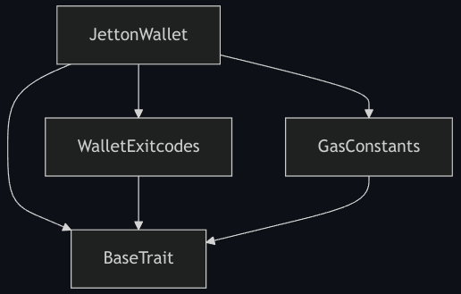

import { Badge } from '@astrojs/starlight/components';

:::note

  This page is still being written as per [#1136](https://github.com/tact-lang/tact/issues/1136).

:::

The Tact compiler can produce various outputs, ranging from the [BoC](/book/cells#cells-boc) of the compiled contract to various supplementary files, such as the [compilation report](#report) or the [contract package](/ref/evolution/otp-006), which is the JSON file with the `.pkg` extension that one can use to [verify the smart contract's origin](https://verifier.ton.org).

With the proper [configuration settings](/book/config), you can customize the behavior of the compiler to skip the generation of some or all the [build artifacts](#artifacts), and even control the addition or exclusion of [getters for supported interfaces](/book/contracts#interfaces).

Since the Tact compiler is a command-line program, some of the configuration settings can be set directly. When inside a folder with a Tact-based project, such as one created using the [Blueprint](https://github.com/ton-org/blueprint) or from the [tact-template](https://github.com/tact-lang/tact-template), refer to the `npx tact --help{:shell}` command for further instructions.

## Build artifacts {#artifacts}

A number of build artifacts can be produced per compilation of each contract. Some of the artifacts can be omitted using [configuration settings](/book/config).

The location of the artifacts depends on the [`output`](/book/config#projects-output) field of the [`tact.config.json`](/book/config). In [Blueprint][bp]-based projects, `output` is not used and all generated files are always placed in `build/ProjectName/`.

### Compilation report, `.md` {#report}

Every markdown compilation report first features the name of the contract that it was prepared for and then the byte size of the contract compiled to [BoC](/book/cells#cells-boc).

The following sub-headings describe the respective sections of the `.md` report.

#### Structures {#structures}

<Badge text="Written as '# Types' prior to Tact 1.6" variant="tip" size="medium"/><p/>

The first section introduces the present structures, i.e. some of the [composite types](/book/types#composite-types), [Structs and Messages](/book/structs-and-messages) that are declared or imported directly in the contract code, as well as those exposed from the Core standard library.

Along with the number of structures present, each of the [Structs][struct] and [Messages][message] are described with their respective signatures and [TL-B schemas][tlb], which include the [message opcodes](/book/structs-and-messages#message-opcodes).

For example:

```md
Total structures: 10

### StateInit
TL-B: `_ code:^cell data:^cell = StateInit`
Signature: `StateInit{code:^cell,data:^cell}`

### Deploy
TL-B: `deploy#946a98b6 queryId:uint64 = Deploy`
Signature: `Deploy{queryId:uint64}`

...etc.
```

[TL-B schema][tlb] of each [Message][message] contains its opcode, which is handy for looking up the auto-generated opcodes as well as confirming the [manually provided ones](/book/structs-and-messages#message-opcodes). For example, the following [Message][message] declarations:

```tact
message GeneratedOpcode { }
message(0x12345678) ManuallySpecifiedOpcode { }
```

translate to their respective [TL-B schemas][tlb]:

```md
### GeneratedOpcode
TL-B: `generated_opcode#6dfea180  = GeneratedOpcode`
Signature: `GeneratedOpcode{}`

### ManuallySpecifiedOpcode
TL-B: `manually_specified_opcode#12345678  = ManuallySpecifiedOpcode`
Signature: `ManuallySpecifiedOpcode{}`
```

where `6dfea180` and `12345678` specified after the `#` in the [constructor definitions](https://docs.ton.org/v3/documentation/data-formats/tlb/tl-b-language#constructors) are opcodes written in hexadecimal notation, representing $32$-bit unsigned integers. Thus, the automatically generated `6dfea180` opcode of the `GeneratedOpcode{:tact}` [Message][message] represents the decimal value of $1845404032$, and the manually provided `12345678` opcode of the `ManuallySpecifiedOpcode{:tact}` [Message][message] represents the decimal value of $305419896$, and **not** $12345678$ as it might appear.

#### Get methods {#getters}

This section specifies the number of available get methods or [getter functions](/book/functions#getter-functions) and outlines them with their argument names, if any.

For example:

```md
Total get methods: 2

## lshift
Argument: x

## gas
```

There, the `lshift(){:tact}` getter has a single argument `x`, whereas the `gas(){:tact}` getter has no arguments.

#### Exit codes {#exit-codes}

This section lists all default [exit codes](/book/exit-codes), as well as those generated from the error messages of the [`require(){:tact}`](/ref/core-debug#require), along with those messages for your convenience.

For example:

```md
* 2: Stack underflow
* 3: Stack overflow
...etc.
* 135: Code of a contract was not found
* 42933: Hey, I'm the error message of require()
```

There, the [exit codes](/book/exit-codes) in the range from $0$ to $255$ are those reserved by TON Blockchain or Tact compiler, while the exit code of $42933$ is produced by the respective call to the [`require(){:tact}`](/ref/core-debug#require) function.

#### Trait inheritance diagram {#trait-diagram}

This section shows a [Mermaid][mm] diagram of [inherited traits](/book/contracts#traits), including the [`BaseTrait{:tact}`](/ref/core-base).

For example:



There, [`JettonWallet`][code-jetton-wallet] inherits the `WalletExitcodes` and `GasConstant` traits, and all inherit the [`BaseTrait{:tact}`](/ref/core-base).

#### Contract dependency diagram {#contract-diagram}

This section shows a [Mermaid][mm] diagram of [contract](/book/contracts) dependencies, i.e. any calls to [`initOf{:tact}`](/book/expressions#initof) in order to compute the initial state of other contracts.

If the contract has no dependencies, only its name is displayed:


However, if the contract, say `FirstOne`, somewhere in its code computes the [initial state](/book/expressions#initof) of another contract, say `SecondOne`, such a relationship is shown in the diagram:


A real-world example of this would be the [`JettonMinter`][code-jetton-minter] contract, commonly referred to as the [Jetton Master](/cookbook/jettons#jetton-master-contract). Often, `JettonMinter` needs the [initial state](/book/expressions#initof) of the [`JettonWallet`][code-jetton-wallet], which is why `JettonMinter` defines the following [internal function](/book/contracts#internal-functions):

```tact
inline fun getJettonWalletInit(address: Address): StateInit {
    return initOf JettonWallet(address, myAddress());
}
```

Thus, the following dependency diagram is produced:


[struct]: /book/structs-and-messages#structs
[message]: /book/structs-and-messages#messages

[tlb]: https://docs.ton.org/develop/data-formats/tl-b-language
[mm]: https://mermaid.js.org/

[code-jetton-wallet]: https://github.com/tact-lang/jetton/blob/70f6c9c51755fcab4b451da0cd2f2016476271cc/sources/jetton_wallet.tact
[code-jetton-minter]: https://github.com/tact-lang/jetton/blob/70f6c9c51755fcab4b451da0cd2f2016476271cc/sources/jetton_minter_discoverable.tact
